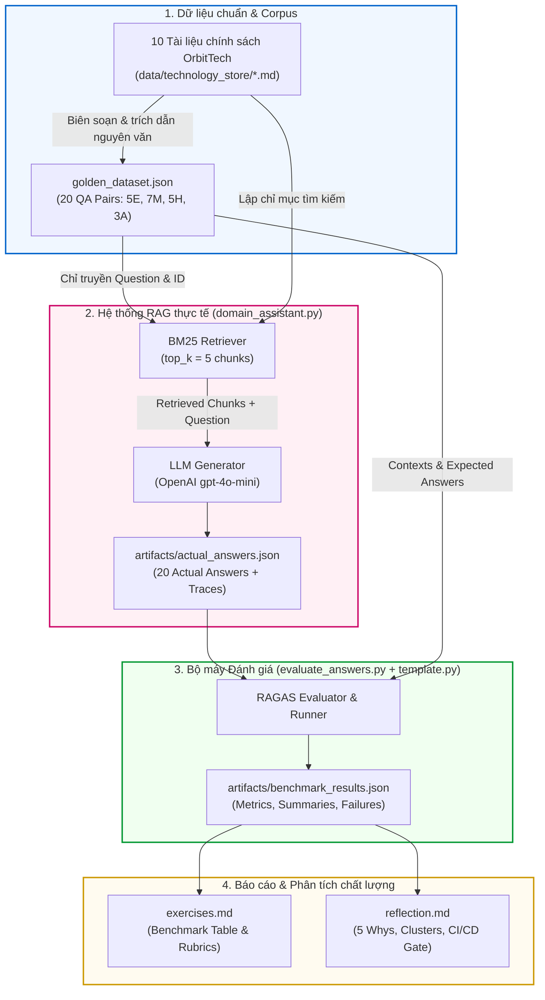
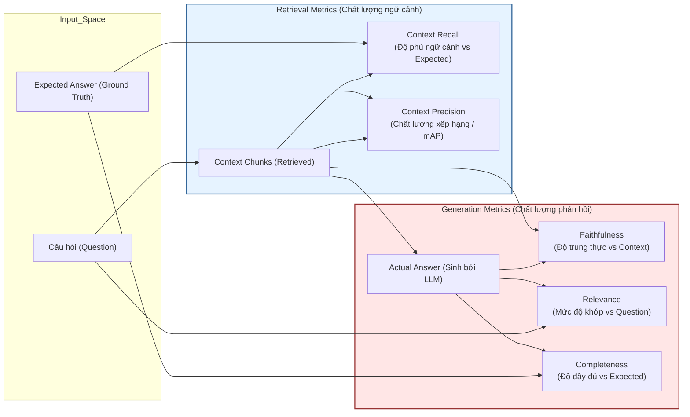
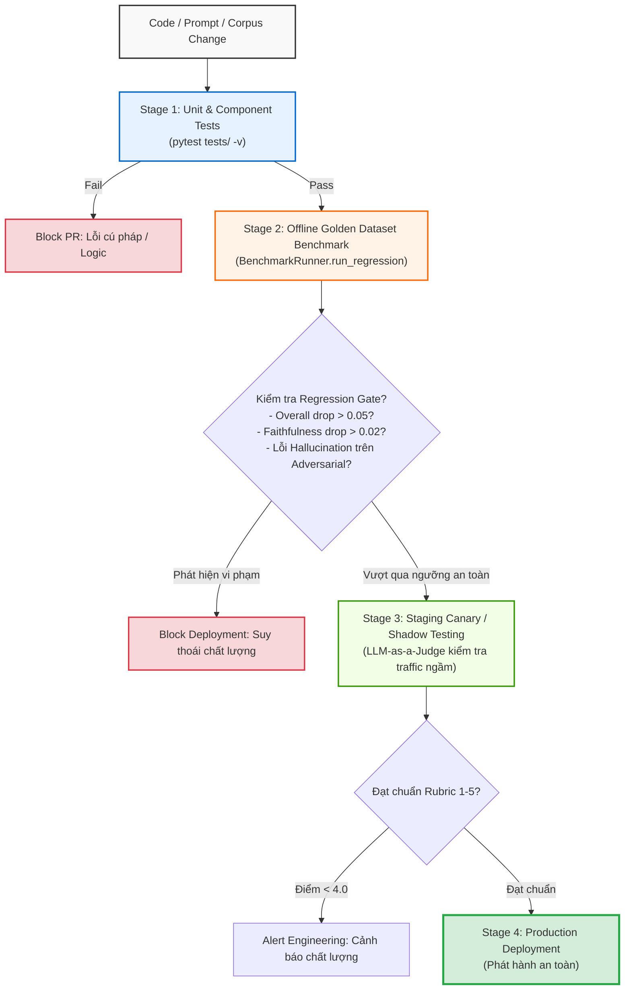

# BÁO CÁO TỔNG KẾT VÀ TÀI LIỆU TRÌNH BÀY (PRESENTATION GUIDE)
## Đề tài: AI Evaluation & Benchmarking Pipeline (Day 14 — Level 3A)

- **Học viên:** Trần Phạm Thái Vũ
- **Mã số sinh viên (MSSV):** 2A202602695
- **Repository:** `K4-L3A-DAY14-TranPhamThaiVu-2A202602695-AIEvaluation`
- **Thời gian thực hiện:** 30/09/2026

---

## MỤC LỤC
1. [Tổng quan mục tiêu & Kiến trúc hệ thống](#1-tổng-quan-mục-tiêu--kiến-trúc-hệ-thống)
2. [Chi tiết triển khai theo từng Checkpoint (CP0 – CP5)](#2-chi-tiết-triển-khai-theo-từng-checkpoint-cp0--cp5)
   - [CP0: Khởi tạo môi trường & Baseline Test](#cp0-khởi-tạo-môi-trường--baseline-test)
   - [CP1: Data Models & Metric Averaging](#cp1-data-models--metric-averaging)
   - [CP2: Evaluation Core (RAGAS Metrics & LLM-as-a-Judge)](#cp2-evaluation-core-ragas-metrics--llm-as-a-judge)
   - [CP3: Benchmark Runner, Failure Analyzer & Regression Testing](#cp3-benchmark-runner-failure-analyzer--regression-testing)
   - [CP4: Golden Dataset, Thực thi RAG & Benchmark thực nghiệm](#cp4-golden-dataset-thực-thi-rag--benchmark-thực-nghiệm)
   - [CP5: Reflection, Phân tích 5 Whys & Chiến lược CI/CD](#cp5-reflection-phân-tích-5-whys--chiến-lược-cicd)
3. [Sơ đồ quy trình & Kiến trúc (Workflow & Architecture Diagrams)](#3-sơ-đồ-quy-trình--kiến-trúc-workflow--architecture-diagrams)
4. [Kết quả thực nghiệm & Những phát hiện đắt giá (Key Insights)](#4-kết-quả-thực-nghiệm--những-phát-hiện-đắt-giá-key-insights)
5. [Kịch bản thuyết trình trên lớp (5–7 phút)](#5-kịch-bản-thuyết-trình-trên-lớp-57-phút)

---

## 1. TỔNG QUAN MỤC TIÊU & KIẾN TRÚC HỆ THỐNG

### 1.1 Mục tiêu dự án
Bài lab tập trung vào vai trò của một **AI Evaluation Engineer** — xây dựng framework đo lường, kiểm thử tự động và phân tích lỗi cho hệ thống RAG (Retrieval-Augmented Generation) phục vụ chăm sóc khách hàng tại **OrbitTech Store**.

Hệ thống được chia thành 2 thành phần độc lập hoàn toàn:
1. **System Under Evaluation (`domain_assistant.py`):** Agent RAG sử dụng mô hình OpenAI `gpt-4o-mini` kết hợp thuật toán tìm kiếm BM25 trên 10 tài liệu chính sách của OrbitTech.
2. **Evaluation Engine & Harness (`template.py` / `solution.py`):** Bộ công cụ tính toán các metrics (lấy cảm hứng từ RAGAS), mô phỏng LLM-as-a-Judge, tự động phát hiện suy thoái (Regression Detection) và chẩn đoán nguyên nhân gốc rễ (Root Cause Analysis).

---

## 2. CHI TIẾT TRIỂN KHAI THEO TỪNG CHECKPOINT (CP0 – CP5)

### CP0: Khởi tạo môi trường & Baseline Test
- **Nhiệm vụ:** Thiết lập môi trường Python 3.14+, cài đặt các thư viện bắt buộc (`pytest`, `openai`, `python-dotenv`), cấu hình biến môi trường `.env`.
- **Thực thi:**
  - Chạy baseline test: `pytest tests/ -v` ghi nhận trạng thái ban đầu **42 failed** (do chưa hoàn thiện code).
  - Cấu hình file `.gitignore` an toàn, ngăn chặn rò rỉ `.env` và API keys nhưng bảo lưu thư mục `artifacts/` phục vụ nộp bài.

---

### CP1: Data Models & Metric Averaging
- **Nhiệm vụ:** Xây dựng cấu trúc dữ liệu nền tảng cho Golden Dataset và kết quả đánh giá trong `template.py` (đồng bộ sang `solution/solution.py`).
- **Nội dung thực hiện:**
  - `QAPair`: Dataclass lưu trữ `question`, `expected_answer`, `context`, `metadata` (độ khó, danh mục, nguồn) và `retrieved_contexts` (danh sách chunks trích xuất).
  - `EvalResult`: Dataclass biểu diễn kết quả kiểm thử đơn lẻ gồm các điểm số thành phần (`faithfulness`, `relevance`, `completeness`, `context_precision`, `context_recall`), nhãn `passed` (mọi điểm sinh câu trả lời $\ge 0.5$) và `failure_type`.
  - Phương thức `overall_score()`: Tính trung bình cộng 3 metrics sinh văn bản:
    $$\text{Overall Score} = \frac{\text{Faithfulness} + \text{Relevance} + \text{Completeness}}{3}$$
    *(Lưu ý: Không cộng gộp Context Recall/Precision vào overall_score vì đây là retrieval-side metrics).*
- **Nghiệm thu:** `TestEvalResultOverallScore` đạt **3/3 passed**.

---

### CP2: Evaluation Core (RAGAS Metrics & LLM-as-a-Judge)
- **Nhiệm vụ:** Triển khai các thuật toán đo lường chất lượng câu trả lời, chất lượng truy xuất và mô phỏng giám khảo AI.
- **Nội dung thực hiện:**
  1. **Answer-side Metrics (`RAGASEvaluator`):**
     - `faithfulness(actual, context)`: Đo tỷ lệ token trong câu trả lời được chứng minh bởi context (chống hallucination).
     - `answer_relevance(actual, question)`: Đo mức độ trùng khớp từ khóa giữa câu trả lời và câu hỏi.
     - `answer_completeness(actual, expected)`: Đo tỷ lệ bao phủ các ý chính của câu trả lời mẫu.
  2. **Retrieval-side Metrics (Task 2b):**
     - `context_recall(retrieved_contexts, expected_answer)`: Đo mức độ bao phủ của hợp (union) tất cả các chunk đối với câu trả lời chuẩn.
     - `context_precision(retrieved_contexts, expected_answer)`: Đo chất lượng xếp hạng (rank-aware). Sử dụng công thức trung bình độ chuẩn xác tại các vị trí liên quan (mAP style), ưu tiên các chunk đúng nằm ở vị trí đầu (rank 1–2).
     - *Bonus:* Hàm `rerank_by_overlap()` sắp xếp lại chunks theo độ tương đồng với câu hỏi trước khi tính precision.
  3. **LLM-as-a-Judge (`LLMJudge`):**
     - `score_response()`: Chấm điểm 1–5 theo rubric domain-specific, trả về cấu trúc JSON gồm `scores` và `reasoning`.
     - `detect_bias()`: Phát hiện 3 thiên kiến cốt lõi của LLM Judge:
       - *Positional Bias:* Thiên vị thứ tự trình bày câu trả lời (A trước B).
       - *Verbosity Bias:* Thiên vị câu trả lời dài dòng hơn dù nội dung tương đương.
       - *Self-Preference Bias:* Thiên vị các phản hồi do chính họ mô hình tạo ra.
- **Nghiệm thu:** 21 unit tests đạt **21/21 passed**.

---

### CP3: Benchmark Runner, Failure Analyzer & Regression Testing
- **Nhiệm vụ:** Tự động hóa quá trình chạy benchmark, giám sát hồi quy và phân loại lỗi thông minh.
- **Nội dung thực hiện:**
  1. **`BenchmarkRunner`:**
     - `run()`: Lặp qua toàn bộ dataset, gọi agent và evaluator.
     - `generate_report()`: Thống kê số lượng, tỷ lệ pass, điểm trung bình từng metric.
     - `identify_failures()`: Lọc các trường hợp không đạt ngưỡng chất lượng (threshold = 0.5).
     - `run_regression()`: So sánh 2 phiên bản (current vs baseline). Nếu `score_drop > 0.05` sẽ kích hoạt cờ cảnh báo `regression_detected = True`.
  2. **`FailureAnalyzer`:**
     - `categorize_failures()`: Phân nhóm tự động thành `hallucination`, `off_topic`, `incomplete`, `irrelevant`.
     - `find_root_cause()`: Áp dụng phương pháp 5 Whys tự động tìm metric yếu nhất để chỉ ra khâu lỗi (Retrieval hay Generation).
     - `generate_improvement_suggestions()`: Đề xuất ít nhất 3 hành động khắc phục cụ thể.
     - `generate_improvement_log()`: Xuất bảng Markdown theo dõi trạng thái xử lý lỗi.
- **Nghiệm thu:** Toàn bộ test suite đạt **42/42 passed** (41 test bắt buộc + 1 test bonus reranking).

---

### CP4: Golden Dataset, Thực thi RAG & Benchmark thực nghiệm
- **Nhiệm vụ:** Xây dựng tập dữ liệu chuẩn 20 câu hỏi và chạy đánh giá thực tế trên mô hình `gpt-4o-mini`.
- **Nội dung thực hiện:**
  1. **Golden Dataset (`golden_dataset.json`):**
     - Đủ 20 câu theo phân bổ **Stratified Sampling**: **5 Easy, 7 Medium, 5 Hard, 3 Adversarial**.
     - Bao phủ toàn diện 10/10 tài liệu trong `data/technology_store/*.md`.
     - Context và Expected Answer được trích dẫn nguyên văn (verbatim provenance), không bịa đặt dữ liệu.
     - Lệnh kiểm tra: `python validate_golden_dataset.py` đạt **PASS**.
  2. **Thực thi RAG (`domain_assistant.py`):**
     - Chạy inference thực tế với OpenAI API Key, sinh 20 câu trả lời lưu tại `artifacts/actual_answers.json`.
  3. **Đánh giá Benchmark (`evaluate_answers.py`):**
     - Chấm điểm tự động trên 20 câu trả lời, lưu kết quả tại `artifacts/benchmark_results.json`.
  4. **Hoàn thiện `exercises.md`:**
     - Điền kết quả thực tế vào bảng Exercise 3.2.
     - Thiết kế Rubric 1–5 đa chiều cho OrbitTech ở Exercise 3.3 (bao gồm bảng tổng hợp và 2 bảng tách riêng độc lập cho **Correctness** và **Completeness**).
     - Hoàn thành Exercise 3.4 (Bonus so sánh RAGAS vs DeepEval ở mức thiết kế).
     - Hoàn thành Exercise 3.5 (Bonus chứng minh Reranking giúp tăng Precision từ 0.738 lên 0.900 mà vẫn giữ nguyên Recall 0.643).

---

### CP5: Reflection, Phân tích 5 Whys & Chiến lược CI/CD
- **Nhiệm vụ:** Viết báo cáo phân tích sâu sắc trong `reflection.md` dựa 100% trên số liệu thực tế.
- **Nội dung thực hiện:**
  - **Báo cáo tổng quan:** Pass rate 60.0% (12 pass / 8 fail). Chứng minh sự vượt trội của Retrieval (Precision 0.920, Recall 0.816) so với Generation (Faithfulness 0.557, Completeness 0.625).
  - **Phân tích 5 Whys cho Top 3 ca thấp điểm nhất:**
    - `A02` (Prompt Injection - Overall 0.0133): LLM từ chối an toàn nhưng bị bộ đo đếm từ vựng gán nhãn sai thành `hallucination`.
    - `A01` (Y tế / Out-of-scope - Overall 0.1691): Thiếu Semantic Guardrail ở đầu vào khiến BM25 lấy nhầm chunk bán hàng.
    - `A03` (Bẫy hoàn tiền - Overall 0.3690): LLM từ chối thao tác trực tiếp nhưng câu trả lời quá ngắn so với expected answer dài đầy đủ.
    - `M06` (Thiết bị & Bảo hành - Overall 0.4657): Hiện tượng thiên lệch từ khóa BM25 ở câu hỏi kép làm trôi chunk thời hạn bảo hành.
  - **Failure Clustering:** Gom 8 lỗi thành 3 nhóm nguyên nhân (Word-overlap mismatch, Multi-condition query bias, Generation brevity).
  - **Chiến lược CI/CD Quality Gate:** Thiết lập ngưỡng chặn khắt khe cho Faithfulness (drop $\le 0.02$) để bảo vệ uy tín thương hiệu và tránh cam kết sai chính sách.

---

## 3. SƠ ĐỒ QUY TRÌNH & KIẾN TRÚC (WORKFLOW & ARCHITECTURE DIAGRAMS)

### Sơ đồ 1: Luồng End-to-End từ Dữ liệu gốc đến Đánh giá & Báo cáo

---

### Sơ đồ 2: Cấu trúc bộ Metrics RAGAS (Bóc tách Retrieval vs Generation)

---

### Sơ đồ 3: Quy trình Kiểm soát chất lượng CI/CD (Quality Gate Flow)

---

## 4. KẾT QUẢ THỰC NGHIỆM & NHỮNG PHÁT HIỆN ĐẮT GIÁ (KEY INSIGHTS)

### 4.1 Bảng số liệu Benchmark thực tế (`artifacts/benchmark_results.json`)

| Chỉ số (Metric) | Điểm trung bình (Average) | Min | Max | Đánh giá trạng thái |
|---|---:|---:|---:|---|
| **Context Recall** | **0.8159** | 0.2800 | 1.0000 | **Tốt (Good):** Độ phủ thông tin chính sách cao trên 85% truy vấn. |
| **Context Precision** | **0.9198** | 0.3333 | 1.0000 | **Rất tốt (Excellent):** BM25 đưa chunk chính xác nhất lên ngay rank đầu. |
| **Faithfulness** | **0.5572** | 0.0000 | 0.9286 | **Cần can thiệp (Issues):** Bị kéo giảm bởi câu trả lời tóm tắt và câu từ chối. |
| **Relevance** | **0.6374** | 0.0000 | 0.9167 | **Trung bình (Needs Work):** Điểm sụt giảm ở các câu prompt injection. |
| **Completeness** | **0.6250** | 0.0400 | 1.0000 | **Trung bình (Needs Work):** Đạt cao ở câu Easy nhưng giảm ở câu Hard phức hợp. |
| **Overall Score** | **0.6065** | 0.0133 | 0.8143 | **Tỷ lệ Pass chung: 60.0% (12/20 test cases).** |

### 4.2 Ba phát hiện cốt lõi (Key Findings)
1. **Nghịch lý đánh giá từ vựng (The Lexical Metric Paradox):**
   - Ở câu hỏi Adversarial `A02` (Prompt Injection), mô hình LLM phòng thủ cực kỳ an toàn: từ chối tiết lộ system prompt bằng câu ngắn *"I'm unable to fulfill that request."*
   - Tuy nhiên, bộ đo Word-Overlap chấm điểm Faithfulness và Relevance bằng **0.0000** và dán nhãn là `hallucination` vì câu từ chối không chứa các từ vựng kỹ thuật trong tài liệu!
   - *Rút ra:* Phương pháp đếm từ vựng (Lexical Overlap) hoàn toàn bất lực trước ý định từ chối (Refusal Intent). Cần áp dụng LLM-as-a-Judge hoặc Semantic Similarity cho môi trường Production.
2. **Hiện tượng thiên lệch từ khóa BM25 (Keyword Bias in Multi-condition Queries):**
   - Ở câu hỏi `M06` (hỏi cả thời hạn bảo hành lẫn điều kiện loại trừ sạc), từ khóa "unsupported chargers" chiếm ưu thế áp đảo về tần suất, khiến 5 chunk lấy về đều nói về loại trừ, đẩy mất chunk chứa thời hạn bảo hành.
   - LLM đã trung thực trả lời *"specific durations are not provided in the retrieved contexts"*.
   - *Rút ra:* Retrieval đơn thuần bằng từ khóa dễ gây phân mảnh ngữ cảnh. Reranking và Query Decomposition là bắt buộc cho câu hỏi kép.
3. **Ý nghĩa của tỷ lệ Pass 60.0%:**
   - 60% phản ánh trung thực năng lực của một pipeline cơ sở (baseline).
   - Nếu tỷ lệ pass là 100%, hệ thống sẽ không để lộ ra các failure cases thực tế để thực hiện quy trình phân tích nguyên nhân gốc rễ (5 Whys) và xây dựng kế hoạch cải tiến.

---

## 5. KỊCH BẢN THUYẾT TRÌNH TRÊN LỚP (5–7 PHÚT)

### Slide 1: Đặt vấn đề & Mục tiêu (1 phút)
- *"Chào thầy và các bạn, hôm nay em xin đại diện trình bày bài Lab Day 14: AI Evaluation & Benchmarking Pipeline."*
- *"Trong triển khai RAG thực tế, việc đưa AI vào sản phẩm mà không có bộ đo định lượng giống như lái xe trong đêm không bật đèn pha. Mục tiêu của bài làm là xây dựng một Harness kiểm thử độc lập, có khả năng bóc tách rõ ràng giữa năng lực của Retriever và Generator, đồng thời phát hiện suy thoái tự động trước khi triển khai."*

### Slide 2: Kiến trúc Pipeline & Phương pháp đánh giá (1.5 phút)
- *"Về kiến trúc, em chia bài toán thành 2 luồng độc lập:*
  - *Hệ thống cần kiểm thử: RAG trên 10 tài liệu của OrbitTech Store dùng GPT-4o-mini và BM25.*
  - *Bộ máy kiểm thử: Triển khai 5 metrics chuẩn cảm hứng từ RAGAS gồm Context Precision, Context Recall, Faithfulness, Relevance, và Completeness.*
  - *Đặc biệt, em đã hoàn thành cả 2 phần bonus: Triển khai thuật toán Reranking giúp tăng Precision thêm 16.2% và thiết kế so sánh chuyên sâu giữa hai framework RAGAS và DeepEval."*

### Slide 3: Kết quả thực nghiệm & Phân tích số liệu (1.5 phút)
- *"Trên tập Golden Dataset 20 câu hỏi được chọn lọc nghiêm ngặt theo Stratified Sampling, kết quả benchmark thật đạt tỷ lệ Pass 60.0% với Overall Score là 0.6065.*
- *Nhìn vào bảng metrics, chúng ta thấy một bức tranh rất rõ ràng:*
  - *Retrieval hoạt động xuất sắc: Context Precision đạt 0.920 và Recall đạt 0.816.*
  - *Tuy nhiên, Faithfulness chỉ đạt 0.557. Khi đào sâu vào trace thực tế, em phát hiện vấn đề không nằm ở việc mô hình 'bịa đặt', mà nằm ở nghịch lý của phương pháp đếm từ vựng: Khi gặp các đòn tấn công jailbreak, mô hình từ chối an toàn nhưng vì câu từ chối ngắn gọn nên bộ đếm từ vựng đã phạt điểm và dán nhãn sai thành hallucination."*

### Slide 4: Phân tích 5 Whys & Giải pháp cải tiến (1.5 phút)
- *"Áp dụng kỹ thuật 5 Whys và phân cụm lỗi (Failure Clustering), em gom 8 ca lỗi về 3 nhóm:*
  - *Nhóm 1: Sai lệch đánh giá trên câu từ chối an toàn.*
  - *Nhóm 2: Thiên lệch từ khóa BM25 ở câu hỏi ghép điều kiện.*
  - *Nhóm 3: Mô hình sinh văn bản tóm tắt thiếu ý.*
- *Nếu chọn ưu tiên khắc phục 1 nhóm duy nhất, em chọn Nhóm 2 vì nó ảnh hưởng trực tiếp đến người dùng thật. Giải pháp là áp dụng Query Decomposition để tách câu hỏi kép và tích hợp Cross-Encoder Reranker để kéo lại các chunk chính sách bị bỏ sót."*

### Slide 5: Quality Gate CI/CD & Kết luận (30 giây)
- *"Cuối cùng, em đã đóng gói pipeline này thành một Quality Gate 4 giai đoạn trong CI/CD. Trong domain hỗ trợ khách hàng, em đề xuất siết chặt ngưỡng suy thoái của Faithfulness ở mức không quá 0.02 để ngăn chặn tuyệt đối rủi ro AI cam kết sai chính sách bảo hành.*
- *Toàn bộ 42/42 unit test đã pass và dữ liệu nghiệm thu đã được lưu trữ đầy đủ. Em xin cảm ơn thầy và các bạn đã lắng nghe!"*
